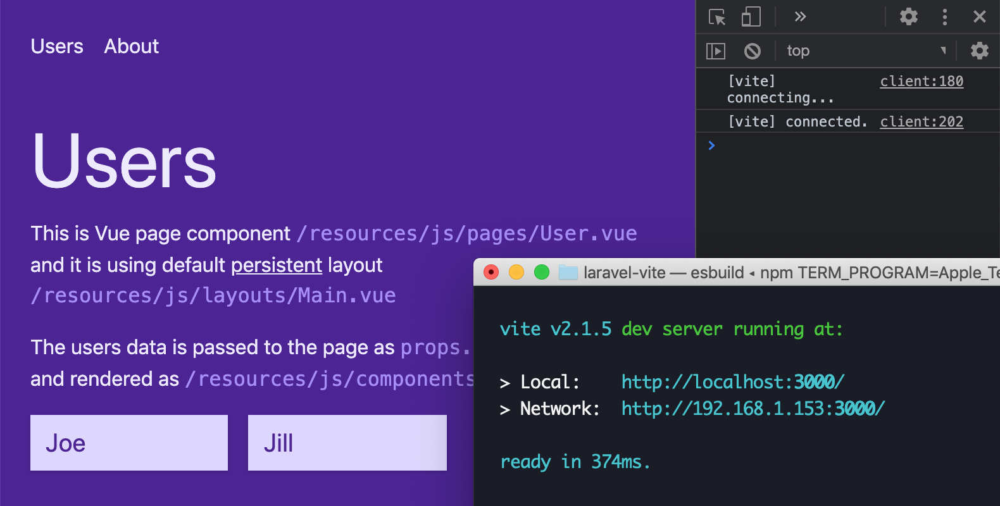

## Using Vite with Tailwind, Laravel, and Inertia. Also known as VITALI stack

### About

This is a project template showing off how to use [Vite 2](https://vitejs.dev/) (super-fast ESM-based development environment, and production bundler) with [Laravel](https://laravel.com/), [TailwindCSS](https://tailwindcss.com/) and [Inertia](https://inertiajs.com/).

### Updates

This is a v2 of the template. Here are the changes compared to the last version:

-   Upgraded all the dependencies
-   Added Tailwind support with the latest JIT compiler
-   Added Inertia support with lazy-loaded pages and routes
-   Added examples with `<script setup>` syntax
-   Added `tsconfig.json` to support Vetur / Volar plugins for VS Code.
-   Added component autoloading
-   Added auto reloading for Laravel files

### Getting started

#### Development

Using Valet

```
composer install
npm install
npm run dev
```

#### Production

```
npm run build
```

To test the production build, change the `.env` file as follows and refresh the page.

```env
APP_ENV=production
```

In the local environment, we include Vite's hot reloader and our main entrypoint (note that `http://localhost:3000/index.js`) refers to `/resources/js/index.js`)

In the production environment, we include the JS and CSS based on the JSON manifest entries.

### Notes

#### Incompatible Laravel manifest

Vite's [manifest generation](https://vitejs.dev/config/#build-manifest) is not compatible with Laravel Mix manifest, so by default, it does not work with [mix()](https://laravel.com/docs/8.x/helpers#method-mix) helper.

To overcome this, this demo project relies on custom manifest parsing. Alternatively, one can use the Vite plugin to support Laravel manifest file https://github.com/ohseesoftware/laravel-vite-manifest.

#### Inertia implementation

To support `<script setup>` syntax for Inertia's [persistent layouts](https://inertiajs.com/pages#persistent-layouts), the component has to export two script sections. Note that we use `layoutName` instead of `layout` since Vite's hot module reloading would conflict with Inertia's API.

```vue
<script setup>
// Component code here
</script>

<script>
export default { layoutName: "Narrow" };
</script>
```
